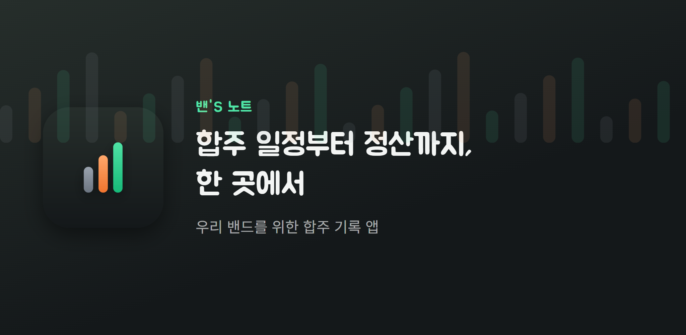
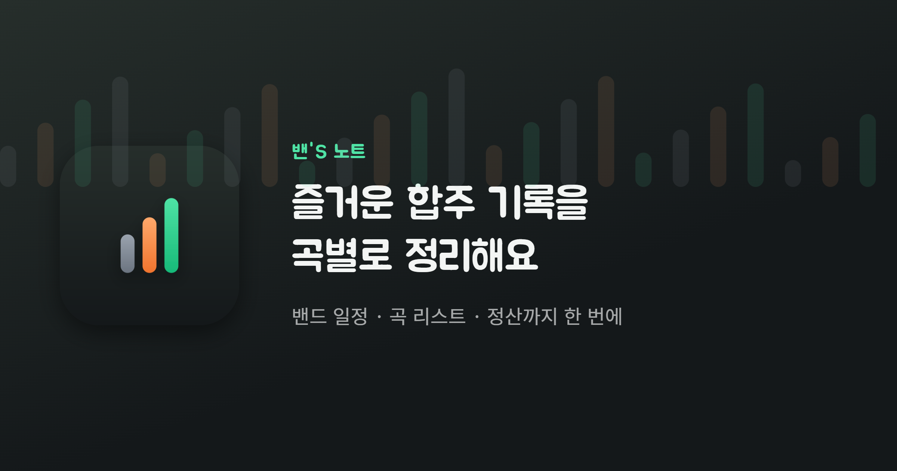
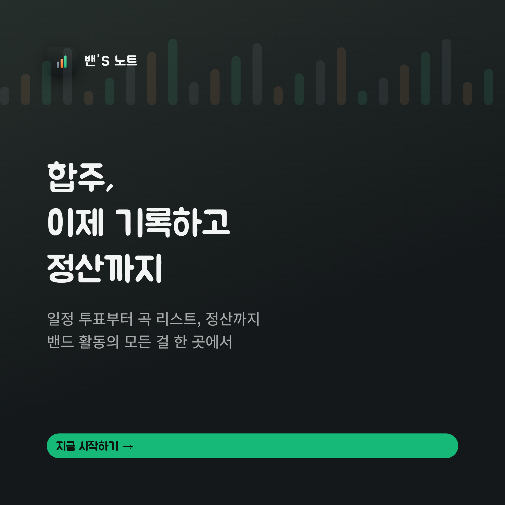
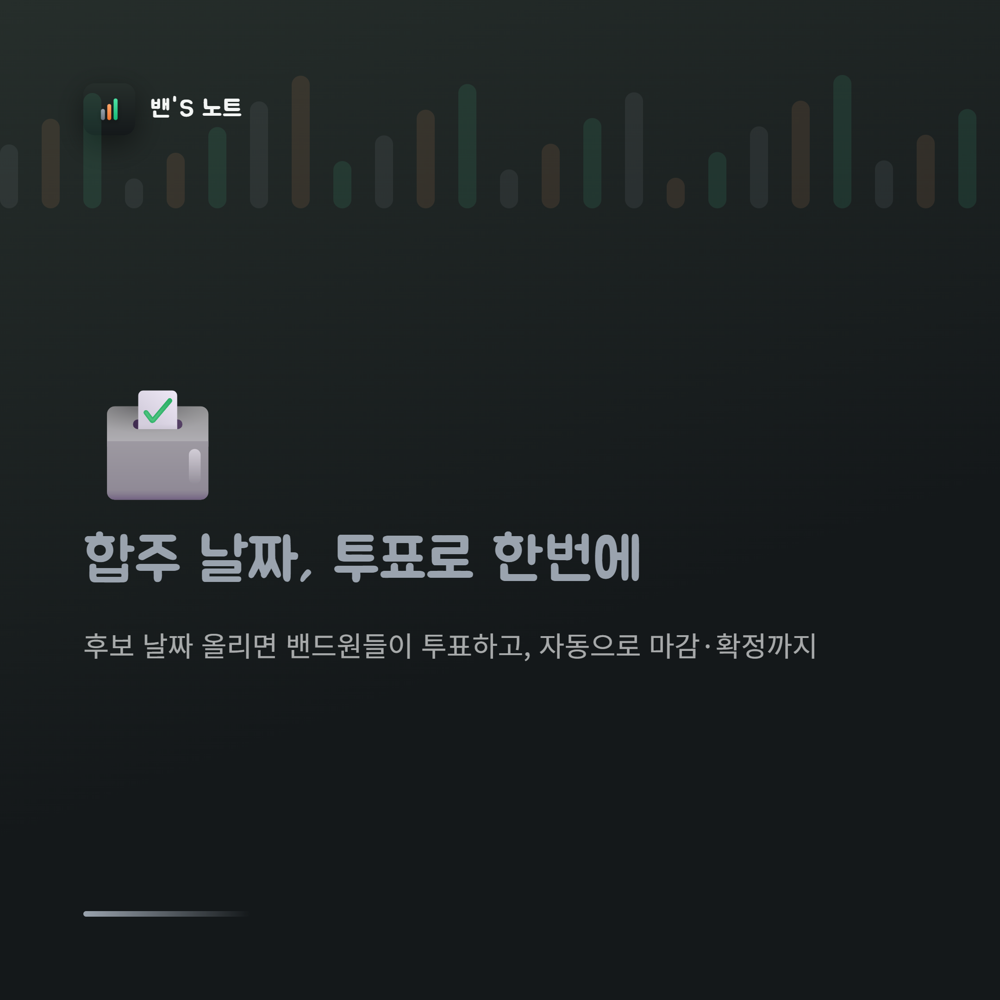
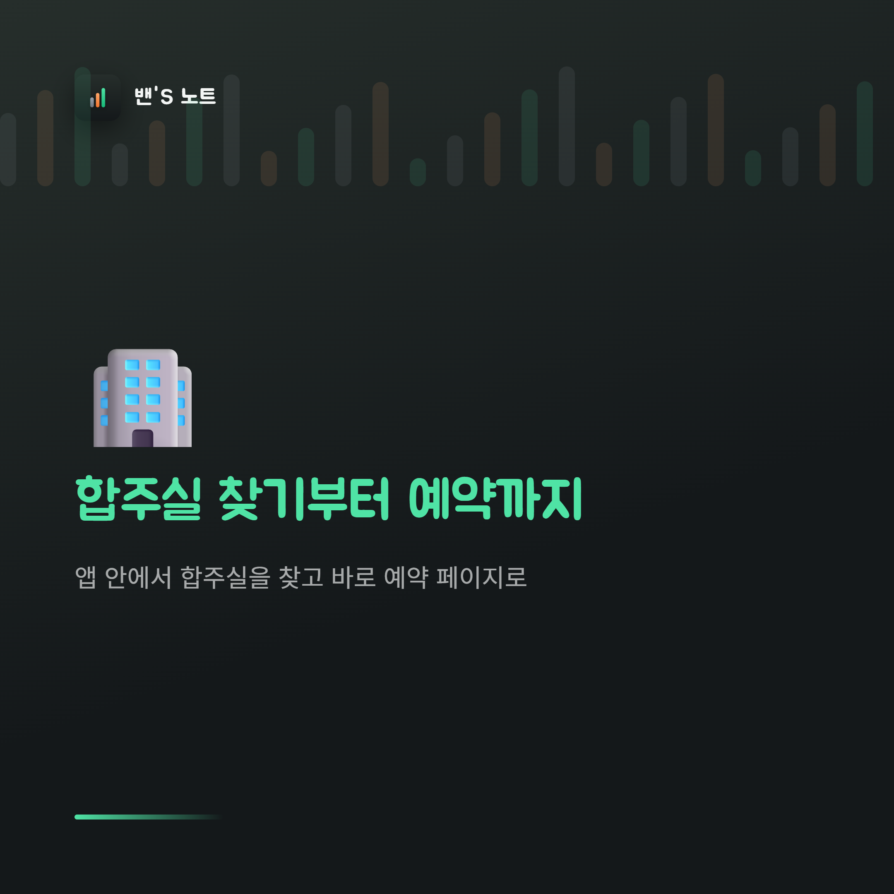
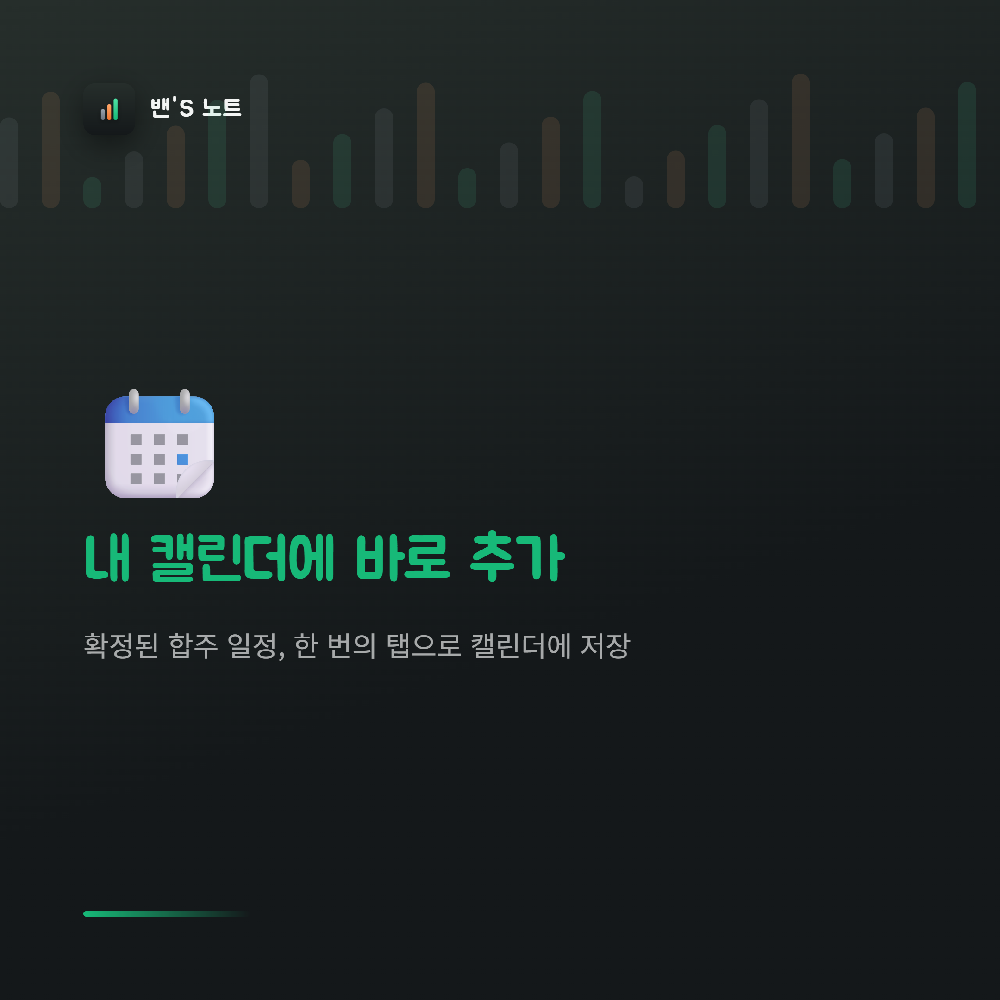
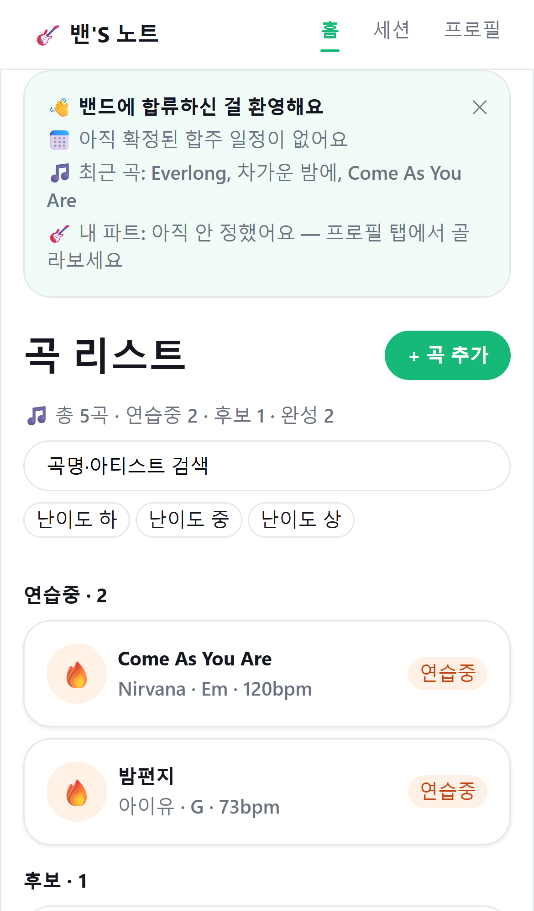
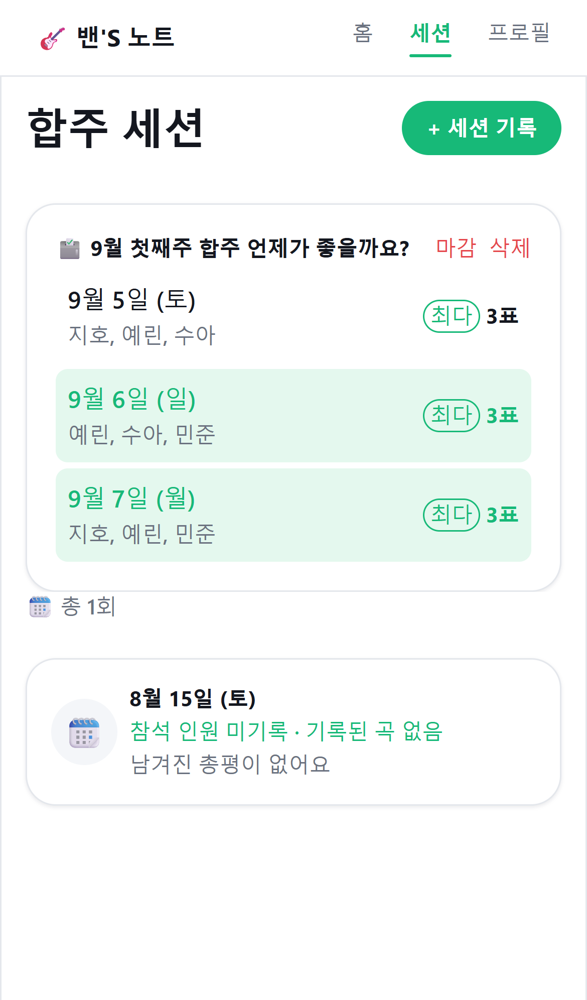

# 밴'S 노트 (Band Note)

**즐거운 합주 기록을 곡별로 정리해요.**
밴드 일정 투표부터 곡 리스트, 정산, 합주실 찾기까지 — 취미 밴드를 위한 합주 기록 앱.

[웹으로 바로 써보기](https://band-note.rorena1586.workers.dev) · [**안드로이드 APK 다운로드**](https://github.com/rorena15/band-note-releases/releases/latest)

---

이 저장소는 **밴'S 노트 앱의 안드로이드 APK 배포 전용**입니다. 소스 코드는 포함돼 있지 않습니다.

## 왜 만들었나

밴드 하다 보면 매번 똑같은 부분에서 번거로움을 느낍니다.

- 다음 합주 언제 할지 단톡방에서 날짜 얘기하다가 흐지부지되고
- 곡 리스트는 어디 메모장에 적어놨는지 기억도 안 나고, 이번 주에 뭘 연습해야 하는지도 매번 다시 물어보고
- 합주실비·회식비 정산은 누가 얼마 냈는지 계산하다가 다 같이 피곤해지고

밴'S 노트는 이 세 가지를 중심으로 만들어졌습니다.

## 기능

<table>
<tr>
<td></td>
<td></td>
</tr>
<tr>
<td></td>
<td></td>
</tr>
</table>

|  | 기능 | 설명 |
|---|---|---|
| 🗳️ | **일정 투표** | 후보 날짜 올리면 밴드원들이 투표, 자동 마감·확정 |
| 🎵 | **곡 리스트** | 후보/연습중/완성 상태 관리, 검색·난이도 필터 |
| 💸 | **정산** | 지출을 자동으로 n분의 1 (또는 커스텀 분담), 계좌 안내 문구까지 자동 생성 |
| 🏢 | **합주실 찾기** | 앱 안에서 합주실을 찾고 바로 예약 페이지로 |
| 📆 | **캘린더 연동** | 확정된 일정, 한 번의 탭으로 기기 캘린더에 저장 |
| 📊 | **밴드 활동 통계** | 합주 횟수, 자주 연습한 곡, 누적 정산액 |
| 🌐 | **밴드 포트폴리오** | 공연 섭외용으로 공유할 수 있는 밴드 소개 페이지 |
| 🎸 | **크로스밴드 뷰** | 여러 밴드에 속해 있다면 한 화면에서 일정 모아보기 |

무료로도 밴드 운영에 필요한 핵심 기능은 전부 쓸 수 있어요.

## 화면

## 설치 방법

1. [Releases](https://github.com/rorena15/band-note-releases/releases/latest)에서 `band-note-*.apk` 다운로드
2. 안드로이드에서 파일 열기 → "출처를 알 수 없는 앱" 설치 허용 필요할 수 있음
3. 설치 후 실행

iOS는 준비 중입니다 — 그동안은 [웹 버전](https://band-note.rorena1586.workers.dev)을 모바일 브라우저에서 그대로 쓰실 수 있어요 (홈 화면에 추가하면 앱처럼 씁니다).

## 피드백

써보시고 불편한 점이나 있었으면 하는 기능 있으면 [Issues](https://github.com/rorena15/band-note-releases/issues)에 남겨주세요.
